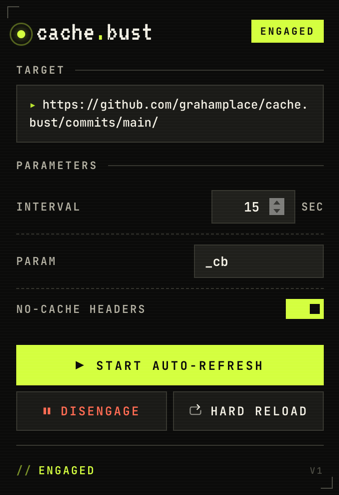

# cache.bust

Chrome extension that auto-refreshes a page on an interval, with a fresh `?_cb=<timestamp>` appended each tick and `Cache-Control: no-cache` request headers attached. Best-effort cache-busting from the client side, for the times you're watching a page whose cache headers say to wait five minutes and the data has already changed.

Built it for live-monitoring election results stuck behind a CDN. Also handy for status pages, ticket queues, deploy dashboards — anything similar.

## Install

Not on the Chrome Web Store. Load unpacked:

1. Clone this repo
2. Open `chrome://extensions`, turn on **Developer mode**
3. **Load unpacked** → pick the cloned folder

## Use

Click the toolbar icon on the page you want fresh, set an interval, hit **START AUTO-REFRESH**. Settings persist per-page (keyed on origin + pathname, so they survive the cache-bust URL changes). **DISENGAGE** stops the timer. **HARD RELOAD** is a one-shot `tabs.reload({ bypassCache: true })`.

## Caveats

Best effort. If the upstream CDN is configured to ignore query strings or refuses to revalidate, no client-side trick will force a re-fetch — you're at the mercy of the origin's cache policy. This extension can help with the browser cache and most query-respecting shared caches; it can't override a CDN that's choosing to serve a stale object, and it doesn't rewrite child-resource URLs (only the top-level navigation gets the new param).

If you control the origin and freshness matters, fix the cache headers there instead.

## Permissions

- `storage` — per-page settings
- `tabs` — reloading the active tab
- `declarativeNetRequest` — tab-scoped session rule that sets `Cache-Control: no-cache, no-store, max-age=0` on outgoing requests
- `http://*/*`, `https://*/*` — the extension is page-agnostic

No telemetry. No network calls beyond the page you're refreshing.

## License

MIT
